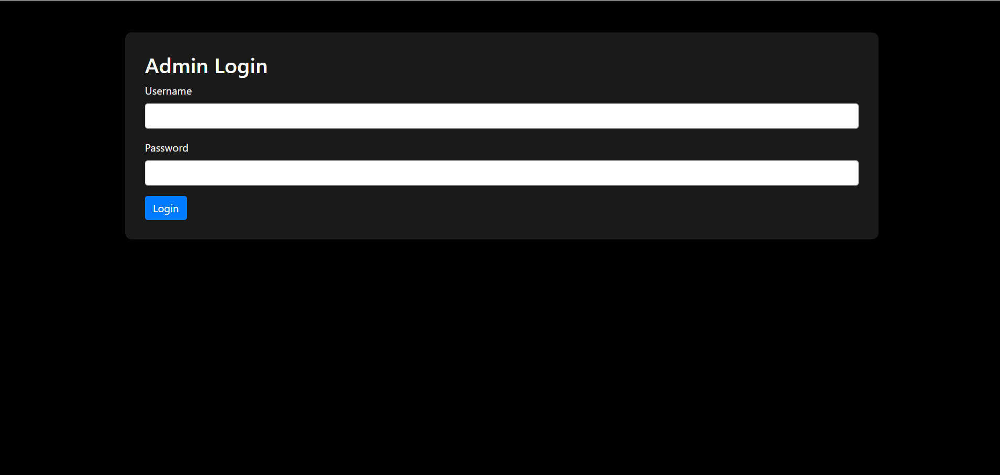
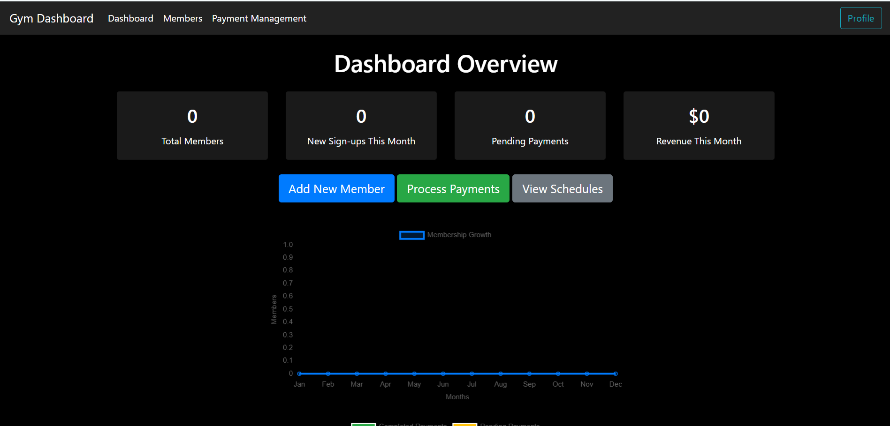
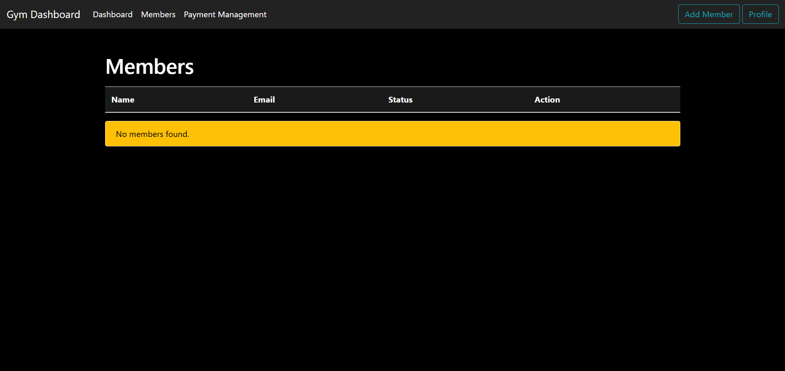
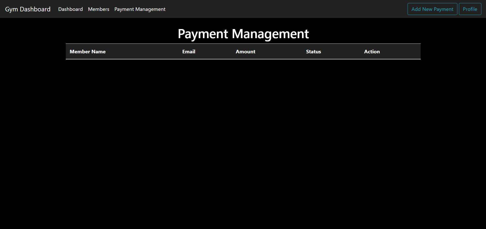

# Gym Management Dashboard

🚀 **Project Overview**

Welcome to the Gym Management Dashboard! This web application is designed for gym administrators to efficiently manage member information, payments, and schedules. Developed using HTML, CSS, JavaScript, and Bootstrap, this project showcases a responsive design with a modern dark theme. 

🔑 **Key Features**

1. **Admin Login Page**:
   - Responsive design using Bootstrap
   - Simple user authentication with JavaScript
   - Modern dark theme for a sleek look

2. **Gym Management Dashboard**:
   - Add new members
   - Process payments
   - View schedules

3. **Member Details Dashboard**:
   - View important member information and payment history
   - Dynamic data loading from local storage
   - User-friendly navigation with a sticky navbar

4. **Members List Management Dashboard**:
   - Dynamic table to view and manage member data
   - Add new members via a modal form with validation
   - Action buttons for member details and status toggling

5. **Payment Management Dashboard**:
   - Dynamic payment table for easy record management
   - Add new payments with member selection and amount input
   - Data persistence using local storage

🌐 **Technologies Used**
- HTML: Structure of the web pages
- CSS: Styling for a modern look
- JavaScript: Dynamic functionality and user interactions
- Bootstrap: Responsive design framework
- Local Storage: Data management for persistence

🤖 **AI Integration**

During the development of this project, AI tools played a significant role in optimizing coding practices, streamlining workflows, and enhancing user experience. The guidance provided by AI helped implement best practices and efficient coding strategies.

📖 **Getting Started**

To run this project locally, follow these steps:
1. Clone the repository: `https://github.com/Pusplatasingh/my-projects/edit/main/gym-management/`
2. Open the `index.html` file in your web browser.
3. Ensure that you have a local server if AJAX requests are involved.

💬 **Feedback**

I’m eager to hear your thoughts! Feel free to reach out with feedback on design, functionality, or any other features you would like to see. Let’s connect and discuss best practices in web development, AI integration, or gym management solutions!

📧 **Contact**
-**Pusplata Singh** - Project Lead, Design, Development, and Enhancements.
- Email: pusplatasingh1104@gmail.com
- LinkedIn: [www.linkedin.com/in/pusplatasingh](www.linkedin.com/in/pusplatasingh)

---

📜 **License**
This project is licensed under the MIT License. See the LICENSE file for more details.

---

## 🛠️ **Contributing**

If you'd like to contribute to this project, feel free to fork it and make changes. Contributions are always welcome!

To contribute:
1. Fork the repository to your own GitHub account.
2. Clone the repository locally to your computer.
3. Create a new branch with a meaningful name for your feature or fix.
4. Make your changes and commit them with a clear and descriptive commit message.
5. Push your changes to your forked repository.
6. Open a Pull Request with a description of what you’ve done and why it’s beneficial.

---

## 🛣️ **Roadmap**

The following features and improvements are planned for future updates:
- **Automated Member Communication**: Adding email or text message functionality to send reminders for upcoming payments or memberships.
- **Real-time Updates**: Implementing real-time updates with WebSockets for live schedule changes and member management.
- **Mobile App Integration**: Exploring the possibility of developing a companion mobile app for the dashboard.
- **User Roles**: Implementing different user roles (Admin, Member, Staff) with varying levels of access and permissions.

---

## 🔧 **Future Enhancements**

- **Advanced Analytics**: Introducing a visual dashboard to track gym performance, member retention, and payment trends.
- **Payment Gateway Integration**: Adding integration with payment services like PayPal or Stripe to process payments online.
- **Enhanced User Interface**: Improving UI/UX based on user feedback to make it even more intuitive and visually appealing.

---

## ⚖️ **License**

This project is licensed under the **MIT License**. See the LICENSE file for more details.

---

## 🎉 **Acknowledgments**

A special thanks to the following resources and tools that helped make this project a success:
- **[Bootstrap](https://getbootstrap.com/)** for making the design responsive and mobile-friendly.
- **[Font Awesome](https://fontawesome.com/)** for the icons used in the project.
- **[AI Tools](https://openai.com/)**: A big thank you to AI for providing valuable coding suggestions and improving my workflow during development.

---

## 📸 **Screenshots**

Here’s a preview of the application’s various pages:

### **Admin Login Page**:

### **Gym Management Dashboard**:

### **Members List Management**:

### **Payment Management Dashboard**:

