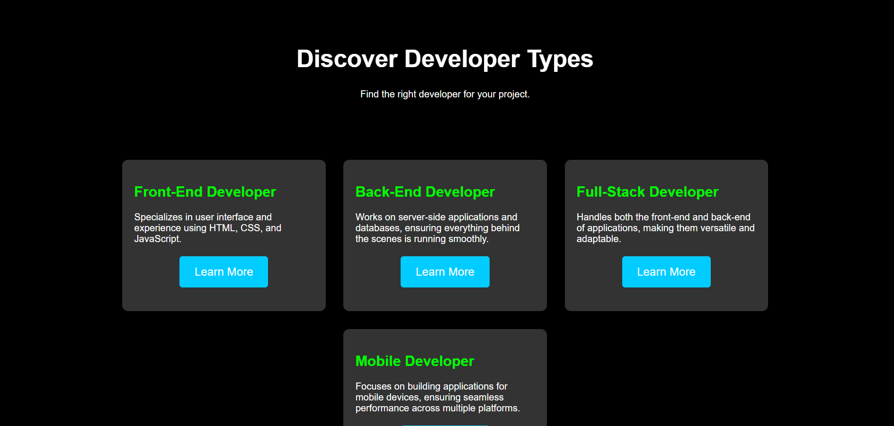
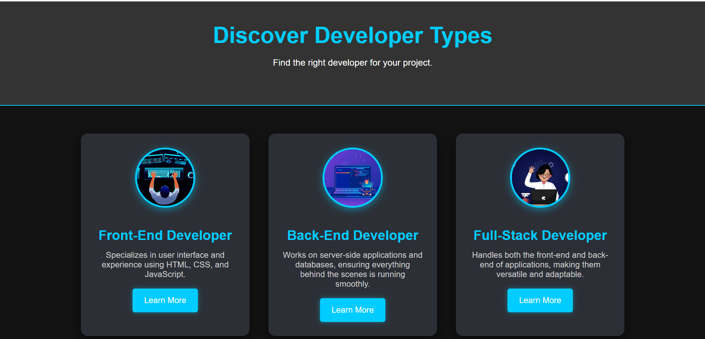

# 🚀 Developer Types Landing Page 🌐

Welcome to the **Developer Types Landing Page**! This project helps users explore the different types of developers, such as **Front-End**, **Back-End**, **Full-Stack**, and **Mobile** developers. With modern design elements and interactive features, it provides a visually appealing and user-friendly experience.

---

## 🎉 **Project Overview**

This landing page showcases the roles of various developers and what they specialize in. The page underwent an exciting **update**, transitioning from a simple, functional design to a modern, interactive, and engaging experience.

---

## 🛠 **Basic Version Features** 🧑‍💻

In the **Basic Version**, the landing page was simple and clean:

- ✅ **Simple Layout**: A clear and basic structure with minimal design elements.
- ✅ **Developer Cards**: Cards that displayed information about each developer type.
- ✅ **Modal**: A "Learn More" button that opens a modal with additional details about each developer role.
- ✅ **Basic Styling**: Simple hover effects and clean layout with plain CSS.

### **Basic Version Preview** 🖼️

---

## ✨ **Updated Version Features** ✨

In the **Updated Version**, we took the landing page to the next level with several design and interactive enhancements:

### 💅 **Design Enhancements**:
- **🌑 Dark Mode**: A sleek, modern dark background with light-colored text for a more professional feel.
- **🖋 Font Upgrade**: Switched to the **Roboto** font for better readability.
- **📸 Developer Images**: Added images for each developer type, making the page more engaging and visually appealing.
- **🎨 Glowing Buttons**: Buttons now feature glowing hover effects for a modern touch.
- **💫 Enhanced Modal**: The modal opens with a glowing effect and smoother animations for a more polished experience.

### 🚀 **New Features**:
- **📱 Fully Responsive**: The page adjusts perfectly on mobile, tablet, and desktop.
- **✨ Glowing Modal**: A stylish glowing border around the modal with fade-in animations.
- **💨 Animations**: Subtle fade-in effects when modals open and when hovering over interactive elements.
- **🔲 Additional Styling**: Images and buttons now have more shadow effects to add depth.

### **Updated Version Preview** 🖼️

---

## 🚀 **How to Use**

1. **Clone or Download** the repository.
2. Open the `index.html` file in your browser to see the landing page in action. 👀
3. The page displays four developer types:
   - **👨‍💻 Front-End Developer**
   - **🖥️ Back-End Developer**
   - **💻 Full-Stack Developer**
   - **📱 Mobile Developer**
4. Click the **"Learn More"** button for each type to view a modal with more details about the developer role.

---

## 🔧 **Technologies Used**

- **HTML5** 🏗️: For the basic page structure and layout.
- **CSS3** 🎨: For styling and adding hover effects, animations, and responsive design.
- **JavaScript** ⚡: For opening and closing modals, adding interactivity.

---

## 📸 **Preview**

### **Basic Version**: 

Here is the preview of the **Basic Version** of the landing page:

---

### **Updated Version**:

Here is the preview of the **Updated Version** of the landing page:

---

## 🤖 **AI Assistance** 

A big thank you to **AI** for assisting with the initial ideas, enhancing the code structure, and providing valuable suggestions in the development process. The guidance from AI helped make the project more efficient and feature-rich. 🙏

---

## 🌟 **Future Enhancements**

- 🎥 Add videos or interactive animations explaining each developer role.
- 📝 Implement a contact form for users to get in touch with developers.
- 🎮 Add more interactive or animated features to further engage users.

---

## 🙌 **Contributors**

- **Your Name** - Pusplata Singh  
- **Contributions**: Project concept, design, development, and enhancements.

---

## 📜 **License**

This project is licensed under the MIT License - see the [LICENSE](LICENSE) file for details.
