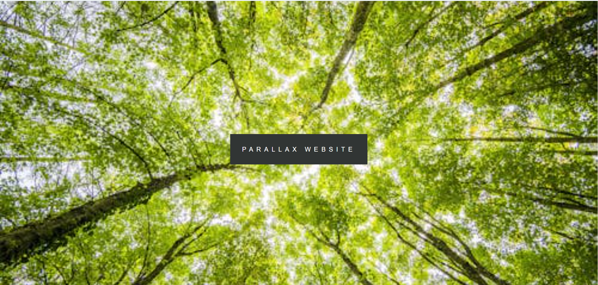
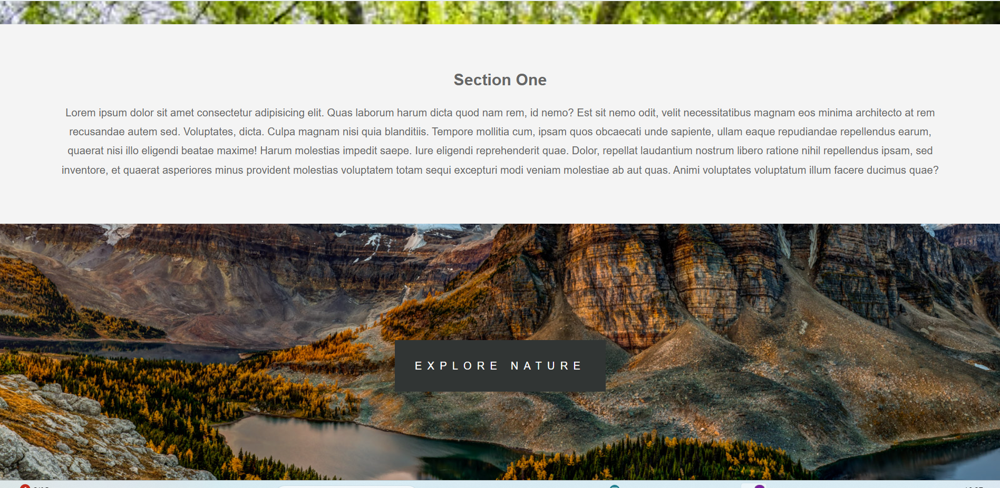
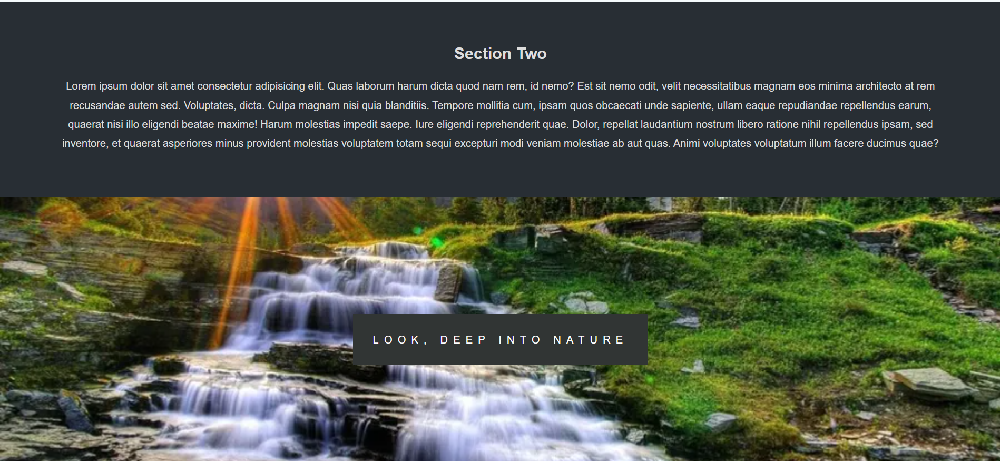
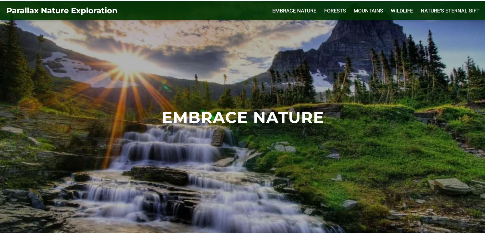
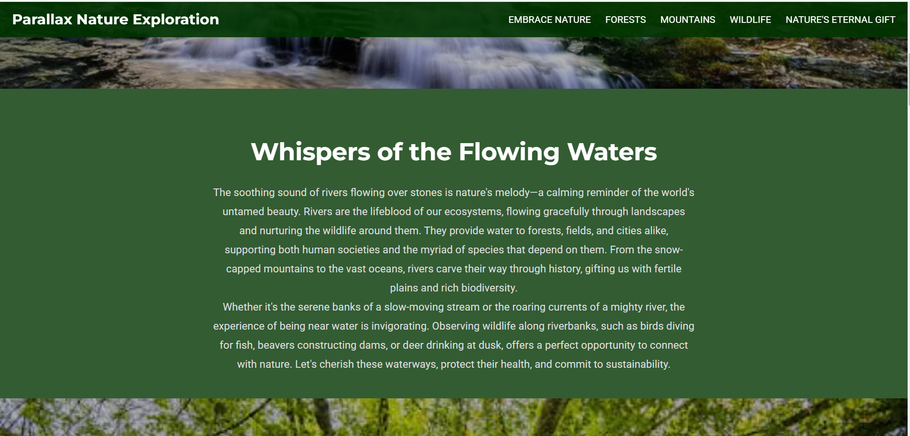
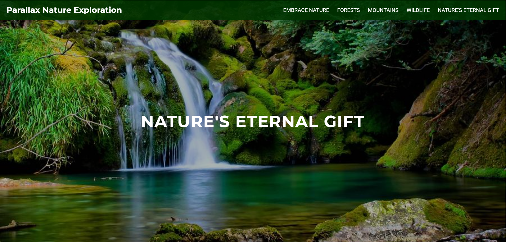

---

## 🌿 **Parallax Nature Exploration Website** 🌳

Welcome to the **Parallax Nature Exploration Website**! Immerse yourself in the beauty of nature with this interactive and visually stunning landing page. The page uses **parallax scrolling** effects to create a dynamic experience, as if you’re exploring nature’s wonders right from your screen.

---

## 🎉 **Project Overview** 🌍

This project is designed to bring the essence of **nature exploration** to life. Through **parallax effects**, smooth animations, and a visually captivating design, this website invites users to experience nature in an engaging and interactive way. Whether you're strolling through forests or gazing at scenic views, our website makes you feel like you're on an adventure.

---

## 🛠 **Key Features of the Parallax Nature Exploration Website** 🌿

### 🌲 **Parallax Scrolling Effect**:
- The page features a **multi-layered parallax effect**, giving the illusion of depth and movement as you scroll through different scenes of nature.
- **Foreground and background layers** move at different speeds, providing an immersive experience that simulates the feel of exploring the great outdoors.

### 🌻 **Responsive and Interactive Design**:
- Fully responsive on **desktop**, **tablet**, and **mobile** devices—your nature adventure remains consistent and engaging no matter the screen size.
- Interactive animations with **smooth transitions** create a seamless experience as users interact with the content.

### 🦋 **Animations and Transitions**:
- Smooth **fade-ins**, **slide-ins**, and **scroll-triggered animations** breathe life into the site.
- Each section of the page reacts differently to scrolling, making the user feel as though they are walking through different natural environments.

---

## ✨ **Design Evolution** 🍃

The project has evolved from a **simple layout** to an **immersive nature experience**, incorporating parallax effects, modern animations, and a responsive design. Take a look at the **before and after** images to get a feel of the transformation:

### 🖼️ **Basic Version (Before)**:

|  |  |  |
|:------------------------------------------------------:|:------------------------------------------------------:|:------------------------------------------------------:|
| **Simple Design**                                      | **Minimal Layout**                                      | **Basic Functionality**                                 |

### ✨ **Updated Version (After)**:

|  |  |  |
|:--------------------------------------------------------:|:--------------------------------------------------------:|:--------------------------------------------------------:|
| **Parallax Scrolling Effect**                            | **Smooth Transitions**                                   | **Immersive Animations**                                  |

---

## 🚀 **How to Experience the Nature Website** 🧑‍💻

Follow these steps to embark on your **virtual nature journey**:

1. **Clone or Download** the repository to your local machine.
2. Open the `index.html` file in your browser and enjoy the immersive **nature exploration** experience. 🌳
3. **Scroll through** the page and witness the beautiful parallax effects as you explore various landscapes.
4. Interact with the sections to see animations and smooth transitions.

---

## 🔧 **Technologies Used** 🌱

- **HTML5** 🏗️: The basic structure and layout of the page.
- **CSS3** 🎨: Styling the page, including creating the parallax effects, animations, and responsiveness.
- **JavaScript** ⚡: Implementing interactive elements like smooth scrolling and animations.
- **jQuery** 🌿: Enhancing animations and handling smooth scrolling effects.

---

## 🌱 **Key Features & Enhancements** 🍃

- **Parallax Scrolling**: Multiple layers move at different speeds, creating depth and the illusion of 3D.
- **Smooth Animations**: Sections fade and slide in, providing dynamic transitions and a polished look.
- **Responsive Design**: The website looks great on any device, ensuring the experience remains immersive across platforms.
- **Nature-Themed Aesthetics**: Soft colors, nature-inspired images, and smooth transitions enhance the overall experience.

---

## 🤖 **AI Assistance** 🌟

A huge thank you to **AI** for assisting with initial ideas, helping to improve the code structure, and offering valuable feedback to enhance the interactivity and visual appeal of this project. Your input made this journey smoother. 🙏

---

## 🌱 **Future Enhancements** 🌿

- 🎥 **Nature Videos**: Add high-quality nature videos in the background to amplify the experience.
- 📝 **Interactive Maps**: Add a map feature where users can explore different natural landscapes.
- 🎮 **Nature Game Elements**: Incorporate game-like features to engage users further with interactive elements.

---

## 🙌 **Contributors** 🌟

- **Your Name** - Project Lead, Design, Development, and Enhancements.
- **AI** - Initial ideas and support with technical suggestions.

---

## 📜 **License** 📑

This project is licensed under the **MIT License**. See the [LICENSE](LICENSE) file for more details.

---

### 🌟 **Contact Us!** 🌿

Feel free to connect with us for any feedback or collaboration. Let’s keep building amazing experiences that bring nature to life in the digital world! 🌍

---

